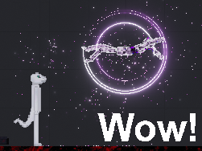

### This README file is intended for Github only, ignore this if you are in the mod's files.

# The People Playground Advanced Character Mod!
###### ~~aka the Sex Mod~~

###### Aubarino's most stupid ppg creation


> This github post is used as a sync between versions,
and mid-development cutting-edge changes,
with almost no playtesting at all! **so be warned.**
this version is full of bugs.



* To setup this version of the mod, go to
```"YOUR STEAM FOLDER\steamapps\common\People Playground\Mods\"```
* Create a folder called ```SexMod``` in this folder.
* Download this github repo and move all its files into the SexMod folder you just made...
* Or clone the repo directly into a folder called ```SexMod``` in the same location.
* You should be able to see a bunch of c# files directly in this ```...\Mods\SexMod``` folder, if you did this correctly.
* Then read the ```READ ME.txt``` for more info on other features and setups.


